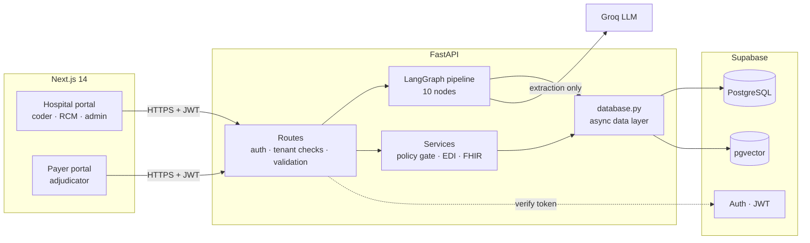
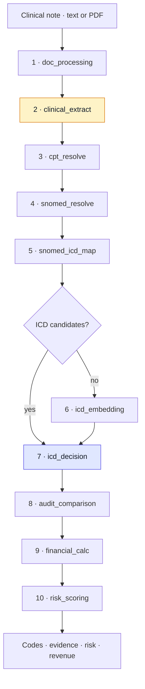

# Integronix

[](https://github.com/NandaKishore2424/integronix/actions/workflows/ci.yml)

**A clinical coding and revenue-integrity engine.** Integronix reads a discharge summary — typed or a scanned PDF — derives ICD-10-CM and CPT codes through a bounded agentic pipeline, audits them against what a human coder billed, and carries the result through claim submission and payer adjudication.

`Python 3.12` · `FastAPI` · `LangGraph` · `Groq` · `PostgreSQL` · `pgvector` · `Supabase` · `Next.js 14` · `TypeScript` · `Docker`

**Live:** [integronix.vercel.app](https://integronix.vercel.app) · **Author:** [Nanda Kishore R](https://nandakishorer.vercel.app/)

---

- [At a glance](#at-a-glance)
- [Architecture](#architecture)
- [The agentic pipeline](#the-agentic-pipeline)
- [Backend design](#backend-design)
- [Retrieval and data engineering](#retrieval-and-data-engineering)
- [Key decisions](#key-decisions)
- [Quality](#quality)
- [Operations](#operations)
- [Running locally](#running-locally)

---

## At a glance

| | |
|---|---|
| **Problem** | Turning clinical prose into billing codes. Undercode and a hospital loses earned revenue; overcode and it is billing fraud. |
| **AI** | A 10-node LangGraph workflow. The LLM is confined to one extraction step — every billing decision is deterministic and explainable. |
| **Knowledge base** | 98,244 ICD-10-CM codes · 379,283 SNOMED CT concepts · 36,401 billable codes indexed as 384-dimensional vectors |
| **Money path** | Adjudication as one Postgres transaction with an optimistic lock · exact `Decimal` arithmetic · an audit trail that cannot be skipped |
| **Multi-tenancy** | Organisation resolved server-side from the verified token — never from the request — and checked on every query |
| **Interoperability** | HL7 FHIR R4 `Claim` · ANSI X12 EDI 837P and 835 |
| **Quality** | 359 tests · CI runs with zero secrets · schema-contract tests for what mocks cannot see |
| **Operations** | Multi-stage Docker image · startup warm-up · liveness/readiness split · request correlation IDs · per-user rate limiting |

## Architecture



Two portals share one API. A **hospital** codes clinical notes and submits claims; a **payer** — a separate tenant — reviews and adjudicates them. Relational data, authentication and vector search live in the same Postgres instance, so a semantic match comes back with the code's clinical and billing metadata in a single query instead of a round trip between two stores.

## The agentic pipeline



<sub>Amber is the only step that calls an LLM. Indigo is where the billed code is decided.</sub>

| # | Node | Responsibility | Decided by |
|---|---|---|---|
| 1 | `doc_processing` | Extracts text with pdfplumber; falls back to Tesseract OCR for scanned pages | code |
| 2 | `clinical_extract` | Prose → diagnoses and procedures, each carrying a verbatim evidence quote | **LLM** |
| 3 | `cpt_resolve` | Procedures → CPT/HCPCS by vector similarity, against a 23-code demo catalogue | code |
| 4 | `snomed_resolve` | Diagnosis → SNOMED CT concept via WHO ICD-API (when configured), the suggested concept, or text match | code |
| 5 | `snomed_icd_map` | SNOMED → ICD-10-CM crosswalk | code |
| 6 | `icd_embedding` | Semantic search over pgvector — **runs only when no candidates exist yet** | code |
| 7 | `icd_decision` | Scores every candidate and selects the code that gets billed | code |
| 8 | `audit_comparison` | AI vs. human code → discrepancy type and DRG flag (`CC_MISSED`, `MCC_OVERCODED`, …) | code |
| 9 | `financial_calc` | Applies the organisation's pricing to produce the claim total | code |
| 10 | `risk_scoring` | Confidence, discrepancy, dollar impact and CC/MCC status → `LOW` / `MEDIUM` / `HIGH`; then saves the case, result and audit record | code |

State moves through one typed `CodingState`; the graph is compiled once and reused across requests. Pricing runs before the saving step deliberately — in the reverse order, every stored result was missing its financial summary.

### The LLM never picks the billing code

The model runs in exactly one node — temperature 0, JSON-constrained output, input capped at 8,000 characters, with timeout and rate-limit handling — and its only job is structure: turn prose into diagnoses anchored to the sentences that support them. The code that is billed comes from a scoring function:

```python
score = (confidence  * 0.40    # strength of the ontology match
       + specificity * 0.30    # earned from the documentation — see below
       + consistency * 0.20    # the code's clinical terms appear in the evidence
       + combination * 0.10    # ICD-10-CM prefers combination codes
       + negation)             # penalty when the chart rules the condition out
```

When a payer disputes a claim, *"the model was confident"* is not an answer; *"this rule fired on this sentence"* is. Keeping the LLM out of the decision is what makes every code reproducible and auditable.

### Specificity has to be earned

When vector search first came online, a routine pneumonia note resolved to **J84.117 — *desquamative interstitial pneumonia*** rather than **J18.9**. The cause was `specificity = len(code) * 0.15`: a longer code scored higher simply for being longer. That is algorithmic upcoding.

The fix encodes the ICD-10-CM guideline — *code to the highest specificity the documentation supports*. A candidate's specificity credit now scales with the share of its distinguishing clinical terms that actually appear in the chart, ignoring words like *unspecified* and *organism* that describe the code rather than the patient:

```python
specificity = base * (0.35 + 0.65 * distinguishing_support)
```

The chart never mentions *desquamative*, so J84.117 forfeits its length bonus and J18.9 wins. When a note does document the rare variant, the specific code wins instead. Tests pin both directions — the rule is *prefer documented*, not *prefer general*.

### Negation

A candidate implying a complication the chart rules out ("no evidence of renal disease") takes a hard penalty. [`samples/03_negation_trap.txt`](samples/03_negation_trap.txt) is written almost entirely in negations and must resolve to **E11.9, without complications**; its sibling, which documents polyneuropathy, must resolve to **E11.42**.

### Failure is contained, not disguised

Every node is wrapped in `@safe_node`. A failing node records where it failed, and **every downstream node is skipped**. Before this, one crash let the remaining nodes run on half-built state and the API returned `200` with a plausible-looking empty result — the worst failure mode a billing system can have. The claims API independently re-verifies, server-side, that a session completed and produced a usable code before it will accept a claim.

## Backend design

### Layering

```
routes/       HTTP only — authentication, tenant checks, request validation
services/     domain logic with no HTTP knowledge — policy gate, EDI, FHIR
agents/       pipeline nodes
database.py   the single async data layer every read and write goes through
```

One data layer is what keeps the async model honest — a single pooled `httpx` client and no blocking calls on the event loop — and it gives the entire backend one seam for testing.

### Authentication and tenant isolation

All 27 `/api/v1` endpoints require a verified Supabase JWT; only the two health probes are public. The caller's organisation is loaded from the database using the token's subject — **never taken from the request**. A client-supplied `organization_id` that disagrees is rejected with `403`, and `Principal.assert_org()` returns the caller's *own* organisation so routes never carry an unchecked value into a query.

Row-Level Security policies exist on the tenant tables as a second layer. Migration `020` populates the JWT claim they depend on, and a feature flag switches the backend to forwarding user tokens so Postgres enforces them too. That rollout is staged deliberately: enabling enforcement before every session has been re-issued would lock users out of their own data.

**Accounts are provisioned server-side.** Public signup is disabled in Supabase — removing a signup page alone changes nothing, because the anon key ships in the browser bundle. Admins create users through `POST /api/v1/admin/users`, which calls the Auth admin API with the service-role key, takes the organisation from the caller's token, rejects roles that don't fit the organisation type, and deletes the Auth account again if the application profile cannot be written.

### Adjudication is one transaction

Adjudication used to be *fetch → check status in Python → update*, so two concurrent approvals could both pass the check and both pay. PostgREST cannot hold a transaction across requests, so the invariant moved into the database:

```sql
UPDATE claims
   SET status = p_new_status, adjudicated_at = now(), ...
 WHERE id     = p_claim_id
   AND status = p_expected_status;          -- optimistic lock

IF NOT FOUND THEN
  RETURN jsonb_build_object('ok', false, 'reason', 'status_conflict');
END IF;

INSERT INTO claim_audit_logs (...);         -- same transaction
```

The losing request gets `409 Conflict` instead of a second payment, and the audit row commits with the status change or not at all. Verified by racing two approvals against one claim: one success, one conflict, one audit row.

### Money is exact

Amounts are `Decimal`, quantised to cents with `ROUND_HALF_UP` and built from `Decimal(str(x))` so binary float error is never imported. Patient responsibility is **allowed − paid**, never a second percentage, so the three amounts always reconcile — a requirement for EDI 835 remittance. Request models bound every money field; before that, `payer_responsibility_pct = 5.0` paid five times the allowed amount.

### Automated payer policy

A pure, fail-closed policy gate decides whether a claim may be auto-approved: demographics present, ICD version accepted, mapping path trusted, confidence and risk within thresholds, and payer-defined rules such as spending caps, excluded procedure prefixes and age limits. Auto-approval is off unless a payer enables it, and any failing check routes the claim to manual review with the reason attached.

<details>
<summary><b>Interoperability details</b></summary>
<br/>

- **FHIR R4** — a proper HL7 `Claim` resource whose coding-system URI (ICD-11 MMS or `icd-10-cm`) follows the path that actually resolved the code.
- **EDI 837P / 835** — raw ANSI X12 segments to the `005010X222A1` specification. Amounts always carry two decimals, provider names are stripped of delimiter characters, and a missing date of birth omits the segment rather than inventing a placeholder.

</details>

## Retrieval and data engineering

**Vector search.** ICD-10-CM codes — every one of the **36,401 billable** codes — and a 23-code CPT/HCPCS demo catalogue (CPT itself is licensed by the AMA) are embedded with `all-MiniLM-L6-v2` (384 dimensions) and queried through pgvector. Clinicians don't write in billing vocabulary, and cosine similarity bridges that gap where keyword search returns nothing. It is deliberately the *fallback*: the deterministic crosswalk answers first. The embedding backfill targets billable codes, because non-billable codes can never be selected and vectors for them would spend storage on rows that can never win.

**Keyword relevance floor.** Early on, a pneumonia note was billed as **S30.810 — *abrasion of lower back*** because "right *lower* lobe" matched "*lower* back" and every hit scored a flat 0.8. Matches are now scored by how much of the query they cover and must clear a floor. Returning nothing is an acceptable answer: the pipeline reports `UNKNOWN`, which cannot be billed.

**Ingestion.** ICD-10-CM is parsed from the CDC/NCHS release files, with billability derived from the hierarchy itself — only leaf codes are billable. SNOMED CT is streamed from the RF2 release and inserted in batches of 50,000. The embedding backfill writes with `COPY` into a staging table followed by one join-`UPDATE` per batch: per-row updates cost minutes per thousand rows against a hosted database, the batch approach takes seconds.

## Key decisions

| Decision | Chose | Over | Because |
|---|---|---|---|
| Who selects the billed code | Deterministic scoring | LLM judgment | Reproducible, auditable, defensible in a payer dispute |
| Orchestration | LangGraph state graph | A hand-written async chain | Explicit topology, typed shared state, first-class conditional routing. A linear chain would work today; the graph pays off as retries and branches grow. |
| Vector store | pgvector in Postgres | A dedicated vector database | Similarity and relational metadata in one query; no second system to keep in sync |
| Concurrent adjudication | Optimistic lock in a SQL function | An application-level check | PostgREST cannot span a transaction across requests |
| Money | `Decimal` | `float` | Remittance files must reconcile to the cent |
| Rate limiting | In-process token bucket | Redis | Exact for a single instance; Redis becomes necessary at the second instance |
| Cold start | Warm-up in the app lifespan | Loading on first request | No user pays for model load, graph compile or cold vector indexes |
| Web framework | FastAPI, async | Flask or Django | An I/O-bound workload, and Pydantic bounds on every input |

## Quality

```bash
cd backend
pytest                  # hermetic suite, no network — what CI runs
pytest -m integration   # live Supabase and Groq
```

| Tier | Tests | Runs against |
|---|---|---|
| Hermetic | 323 | An in-memory fake of the data layer — no network, no credentials |
| Integration | 36 | Live Supabase and Groq; skipped automatically without credentials |

**CI runs with no secrets configured,** so a green build is evidence the hermetic tier is genuinely hermetic: the moment a test reaches the network, CI fails. Route tests assert the *shape of the query* a route issued, not just its status code — a lock only exists if the status predicate is really in the `WHERE` clause.

**What mocks cannot check.** A fake database enforces no foreign keys and no `CHECK` constraints, and that gap produced a real bug: audit rows were written with a `public.users` id while the column references `auth.users`. The route logic was correct and every mocked test passed; Postgres rejected the first real submission. [`test_schema_contract.py`](backend/tests/test_schema_contract.py) now pins the schema facts the code relies on — foreign-key targets, permitted status values, and the columns and functions the code depends on.

Coverage is concentrated where mistakes cost money:

| Module | Coverage |
|---|---|
| `services/fhir_claim_builder.py` | 96% |
| `models.py` | 95% |
| `services/edi_837_builder.py` | 89% |
| `services/payer_policy_gate.py` | 89% |
| `services/edi_835_builder.py` | 86% |

CI also builds and smoke-tests the Docker image on every push: it must boot, answer liveness, report `503` readiness with no database behind it, load its embedding model from the baked copy, and still return `401` on protected routes.

## Operations

- **Startup warm-up.** The first request after a restart took ~55 s — importing torch, compiling the graph, loading the embedding model and waiting for Postgres to page pgvector indexes back into memory. That work now happens in the FastAPI lifespan before the server accepts traffic, and readiness reports the instance unready if the model failed to load.
- **Liveness vs. readiness.** `/health/live` touches nothing downstream — failure means restart. `/health` checks the database and returns `503` when the instance cannot serve — failure means stop routing traffic to it. Conflating the two turns a database blip into a restart loop.
- **Correlation IDs.** Middleware assigns every request an ID and carries it through a `ContextVar`, so each log line emitted while serving that request is tagged automatically. The ID is returned as `X-Request-ID` and quoted in error responses.
- **Rate limiting.** The pipeline endpoints spend an LLM call per request, so they sit behind a per-user token bucket — keyed on the user rather than the IP, since a hospital network shares one address.
- **Deployment.** CI runs the tests, builds the image, boots it for a smoke test, and only then publishes it to GHCR as `:main` and `:sha-<commit>`. The API runs on a small EC2 instance that is started only when needed: at boot it updates its dynamic-DNS name, pulls the newest image and starts it behind nginx with Let's Encrypt TLS. The container is loopback-only, read-only, runs with no Linux capabilities and a memory cap. The frontend deploys to Vercel. Host configuration lives in [`deploy/`](deploy/).
- **Container.** Multi-stage build, CPU-only PyTorch wheel (the default bundles CUDA), non-root user, and configuration injected at runtime so one image moves unchanged between environments. The embedding model is baked in and loaded **by path**: loading it by hub name inside the image fails offline, which would have broken vector search on every deploy.

## Project structure

```
backend/
├── agents/         LangGraph nodes and graph wiring
├── routes/         HTTP endpoints — code, claims, cases, analytics, icd, parse, payers, admin, health
├── services/       policy gate, EDI 837/835, FHIR, embedding model, warm-up, account provisioning
├── scripts/        ICD / SNOMED / CPT ingestion and embedding backfill
├── tests/          285 tests
├── auth.py         JWT verification, Principal, role and tenant checks
├── database.py     single async data layer
├── middleware.py   request correlation
└── Dockerfile
frontend/           Next.js 14 (App Router) — hospital and payer portals
migrations/         versioned schema and seed SQL
samples/            synthetic clinical notes
```

## Running locally

Requires Python 3.12, Node 20 with pnpm, a Supabase project and a Groq API key.

```bash
# backend
cd backend
python -m venv venv && venv/bin/pip install -r requirements.txt
cp .env.example .env              # Supabase and Groq credentials
venv/bin/uvicorn main:app --reload --port 8000

# frontend
cd frontend
pnpm install
cp .env.local.example .env.local
pnpm dev
```

Apply `migrations/schema/*.sql` and then `migrations/seeds/*.sql` in order, and run the ingestion and embedding scripts in `backend/scripts/`. To run the API in a container: `cd backend && docker compose up --build`.

### Sample notes

| File | Expected | Demonstrates |
|---|---|---|
| `01_pneumonia_simple` | `J18.9` + CPT `71045` | The full path, including a billable procedure |
| `02_diabetes_with_complication` | `E11.42` + `E11.22` + `N18.32` | Documented specificity is rewarded; diabetes with CKD follows the ICD-10-CM "with" convention |
| `03_negation_trap` | `E11.9` | Specificity the chart rules out is refused |

All sample notes are synthetic.

---

**Nanda Kishore R** · [Portfolio](https://nandakishorer.vercel.app/) · [LinkedIn](https://www.linkedin.com/in/nanda-kishore-7290551b8/)

Integronix began as a Virtusa Jatayu Hackathon project with Subashini S and Nathin R, and has since been substantially re-engineered — authentication and tenant isolation, the transactional money path, the scoring corrections, the test suite, CI and containerisation.
