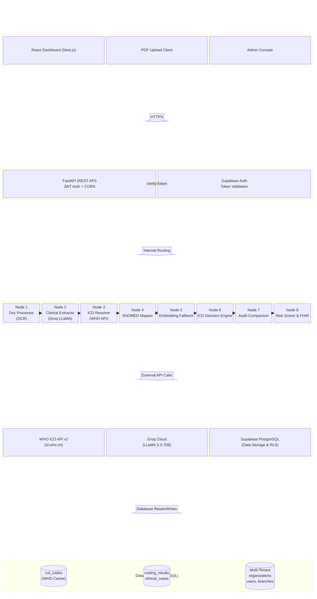

## 2. System Architecture

### 2.1 Architectural Overview
The Integronix system is built on a modern, cloud-native architecture designed for high scalability, real-time processing, and strict data isolation (multi-tenancy). The system is logically divided into four primary tiers:
1. **Client Layer:** Web-based interfaces for end-users and administrators.
2. **API Gateway & Services:** A RESTful API layer that handles authentication, routing, and core business logic.
3. **AI Pipeline (LangGraph):** The core intelligence engine that processes clinical text, resolves codes via the WHO ICD API, and performs risk scoring.
4. **Data Layer:** A multi-tenant database built on PostgreSQL (Supabase) handling structured storage, user management, and vector embeddings.

### 2.2 System Block Diagram

The following diagram illustrates the high-level architecture of the Integronix system, detailing the flow from the client through the API and into the AI processing pipeline.

### 2.3 Component Descriptions

#### 2.3.1 Client Layer
The presentation tier is a server-side rendered application built using **Next.js**. It provides a responsive, single-page application (SPA) experience for medical coders and administrators. Hosted on **Vercel**, it connects to the backend exclusively via HTTPS REST calls, ensuring no direct database access occurs from the browser.

#### 2.3.2 API Gateway (FastAPI)
The backend is powered by Python and **FastAPI**, serving as the unified entry point. It handles:
*   **Routing:** Endpoints like `/code/run` (text payload) and `/code/run-pdf` (multipart upload).
*   **Security:** JWT validation via Supabase Auth.
*   **Session Management:** Initialization of the coding state and injection of organization-specific settings (e.g., `icd_version`).

#### 2.3.3 LangGraph AI Pipeline
Integronix replaces traditional sequential processing with a stateful, graph-based execution engine (`langgraph`). The pipeline manages memory (`CodingState`) across 8 specific nodes:
1.  **Document Processor:** Extracts text from uploaded files using `pdfplumber` (native digital) or falls back to Tesseract OCR for scanned documents.
2.  **Clinical Extractor:** Prompts the Groq LLaMA 3.3-70B model to extract structured entities (diagnoses, procedures, medications).
3.  **ICD Resolver:** The primary resolution engine. Integrates with the **WHO ICD API v2** (MMS linearization for ICD-11). If the WHO API is unavailable, it falls back to a SNOMED CT database lookup.
4.  **SNOMED Mapper:** A legacy crosswalk node that maps SNOMED codes to ICD-10. This is skipped entirely if Node 3 successfully retrieves data from the WHO API.
5.  **Vector Embedding:** Last-resort fallback. Extracts candidate codes using pgvector-based similarity search against the local `icd_codes` database. Skipped if candidates are already present.
6.  **Decision Engine:** Deterministically evaluates the list of candidate codes, calculates confidence scores, and selects the primary billable code.
7.  **Audit Comparison:** Compares the AI's final code against any human-provided code, logging discrepancies for audit trails.
8.  **Risk & Output:** Calculates clinical risk scores, formats the output into an HL7 FHIR R4 Condition resource, and commits the result to the database.

#### 2.3.4 Data Layer (PostgreSQL)
The persistent storage tier is housed in **Supabase (PostgreSQL)**. It is specifically designed for isolation:
*   **Tenant Isolation:** Row-Level Security (RLS) policies enforce strict data segregation, ensuring users can only read/write data linked to their specific `organization_id`.
*   **Schema:** Key tables include `organizations`, `branches`, `user_profiles`, `clinical_cases` (document storage), `coding_results`, and `org_settings` (for per-hospital ICD version configuration).
*   **Cache:** The `icd_codes` table is utilized as a warm cache for WHO API lookups, accelerating subsequent requests and storing payer-specific reimbursement rates.
