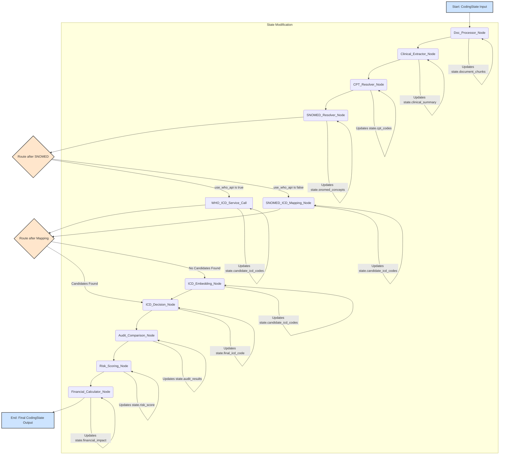
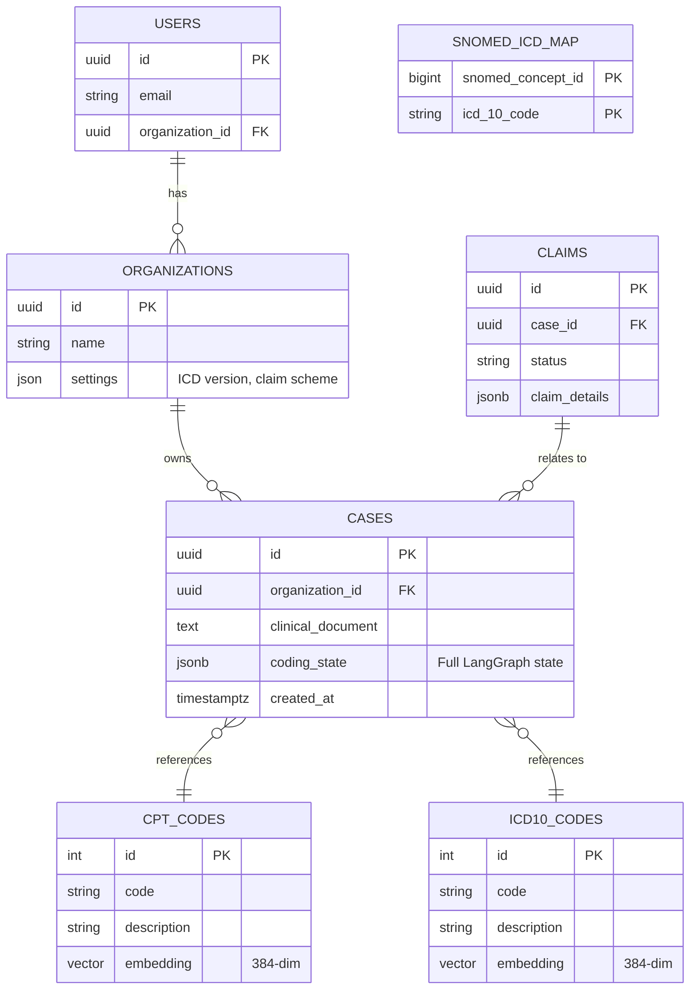
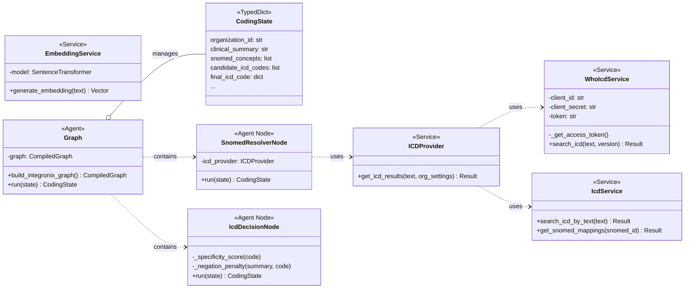

# Integronix System Diagrams

This document contains all the architectural, pipeline, and data model diagrams for the Integronix system.

## 1. Use Case Diagram

This diagram illustrates the primary actors and their interactions with the Integronix system, from initial setup to the final coding and auditing process.

```mermaid
graph TD
    subgraph "Integronix Platform"
        A[Hospital Administrator] -->|1. Signs up and configures organization| B(Organization Setup)
        B -->|2. Sets ICD version (10/11), claim scheme, API keys| C(System Configuration)
        
        D[Medical Coder / Auditor] -->|3. Uploads clinical document (PDF/Text)| E(API Endpoint: /code/run-pdf)
        E --> F{Coding & Auditing Pipeline}
        
        F -->|4. Processes Document| G(Document Processing Node)
        G -->|5. Extracts Clinical Entities| H(Clinical Extraction Node - LLM)
        H -->|6. Resolves CPT Codes| I(CPT Resolver Node)
        I -->|7. Resolves SNOMED-CT Concepts| J(SNOMED Resolver Node)
        
        J --> K{ICD Version Routing}
        K -- ICD-11 --> L(WHO API Service)
        K -- ICD-10 --> M(SNOMED-ICD10 Mapping Service)
        
        L --> N(Candidate Generation)
        M --> N
        
        subgraph "Fallback Mechanism"
            direction LR
            N -- No candidates found --> O(Vector Embedding Search)
            O --> P(Similarity Search in DB)
            P --> N
        end

        N -->|8. Selects final code| Q(Deterministic ICD Decision Node)
        Q -->|9. Compares with original codes| R(Audit Comparison Node)
        R -->|10. Scores risk| S(Risk Scoring Node)
        S -->|11. Calculates financial impact| T(Financial Calculator Node)
        
        T -->|12. Generates final report| U(Final JSON Output)
        U -->|13. Returns detailed analysis to user| D
    end

    subgraph "External Systems"
        V(WHO ICD-11 API)
        L --> V
    end

    classDef actor fill:#ff9,stroke:#333,stroke-width:2px;
    class A,D actor;
```

## 2. System Architecture Diagram

This diagram provides a comprehensive overview of the entire Integronix system, including the frontend, backend, database, and external services.

```mermaid
graph TD
    subgraph "User Interface"
        A[User Browser] -->|Interacts via Next.js App| B(Frontend: Next.js)
    end

    subgraph "Backend Infrastructure (FastAPI)"
        B -->|API Requests (HTTPS)| C{API Gateway / Load Balancer}
        C --> D(FastAPI Application)
        
        subgraph "Core Services"
            D --> E(Routes: /code, /cases, etc.)
            E --> F(Agentic Pipeline: LangGraph)
            D --> G(Services: ICD Provider, PDF Service, etc.)
            D --> H(Authentication & Authorization)
        end

        subgraph "Agentic Pipeline (LangGraph)"
            direction LR
            F --> F1(Doc Processor)
            F1 --> F2(Clinical Extractor)
            F2 --> F3(SNOMED/CPT Resolvers)
            F3 --> F4(ICD Mapping/WHO API)
            F4 --> F5(Vector Search Fallback)
            F5 --> F6(Deterministic Decision Engine)
            F6 --> F7(Auditing & Financial Analysis)
        end
    end

    subgraph "Data & Storage Layer"
        I(Supabase: PostgreSQL)
        I --> J(pgvector: For Embeddings)
        I --> K(Tables: Cases, Claims, Users, SNOMED-ICD Map)
        
        G --> I
        F5 --> J
    end

    subgraph "External Services & APIs"
        L(Groq API) -->|Provides LLM for Extraction| F2
        M(WHO ICD API) -->|Provides ICD-11/10 Data| F4
        N(SentenceTransformers) -->|Generates Embeddings| O(Embedding Generation Scripts)
        O --> J
    end

    subgraph "DevOps & Deployment"
        P(Docker/Docker Compose) -->|Containerizes Backend| D
        Q(GitHub Actions) -->|CI/CD| P
    end

    classDef fe fill:#cde4ff,stroke:#333;
    class A,B fe;
    classDef be fill:#d5e8d4,stroke:#333;
    class C,D,E,F,G,H,F1,F2,F3,F4,F5,F6,F7 be;
    classDef db fill:#ffe6cc,stroke:#333;
    class I,J,K,O db;
    classDef ext fill:#f8cecc,stroke:#333;
    class L,M,N ext;
    classDef devops fill:#e1d5e7,stroke:#333;
    class P,Q devops;
```

## 3. Agent Architecture Diagram (LangGraph Pipeline)

This diagram details the flow of control and data within the LangGraph-based agentic pipeline.



## 4. Database ER Diagram

This diagram shows the entity relationships within the PostgreSQL database managed by Supabase.



## 5. Class Diagram (Python Backend)

This diagram outlines the key Python classes and their relationships in the backend.


